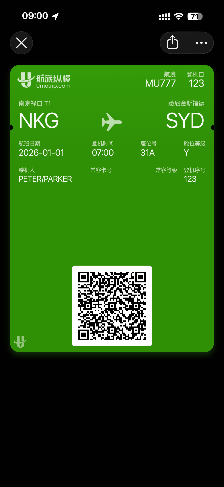

# Boarding Pass Studio · 登机牌生成器

[在线体验 / Live Demo](https://carey-bk.github.io/boarding-pass-generator/) · [Netlify 版本](https://boardingpassstudio.netlify.app/)

[Aztec 版本 / Aztec mode](https://carey-bk.github.io/boarding-pass-generator/?barcode=aztec)

[Aztec 截图示例 / Sample export](docs/preview-aztec.png)

[国泰样式 / Cathay style](https://carey-bk.github.io/boarding-pass-generator/?style=cathay) · [国泰截图示例 / Cathay sample](docs/preview-cathay.png)



## 中文介绍

一个纯前端的登机牌样机生成器。填写机场、航班、乘机人和座位信息后，可实时预览并下载登机牌 PNG。支持航旅纵横绿色票面与国泰白色票面，并分别导出深色或浅色 iPhone 截图样式的图片。

条码数据遵循 IATA Resolution 792 单航段 BCBP 的 58 字符强制字段核心结构，可选择 QR Version 7 或 Aztec。切换格式只改变条码图案，不改变编码的明文（包括空格），也不改变登机牌上的文字信息。应用不上传填写内容，所有图像均在浏览器本地生成。

### 功能

- 实时预览登机牌
- 航旅纵横 / 国泰两种票面；样式与 QR / Aztec 格式可独立切换
- 国泰版包含航站楼、英文日期、座位信息与舱位色条；可一键填入虚构乘机人示例
- 用户自定义航程、航班、乘机人、座位和常客信息
- 生成符合 BCBP 核心字段结构的 QR / Aztec 码
- 下载独立登机牌 PNG 或 iPhone 截图
- 适配桌面端和移动端
- 支持 Netlify 与 GitHub Pages 静态托管

### 本地运行

需要 Node.js 20+ 和 pnpm：

```bash
corepack enable
pnpm install
pnpm dev
```

检查和构建：

```bash
pnpm test
pnpm build
```

### 重要说明

本项目仅用于界面设计、样机制作与开发测试。生成内容不含航空公司数字签名，也不连接航空公司的值机或 DCS 系统，因此不是有效旅行凭证。本项目与航旅纵横及任何航空公司均无官方关联。

Aztec 编码采用 [bwip-js / BWIPP](https://github.com/metafloor/bwip-js)，按需加载；测试通过独立的 [ZXing 解码器](https://github.com/zxing-js/library) 验证两种条码均能还原原始 BCBP 明文。

国泰样式只改变显示与截图布局，不改变现有条码编码规则。航站楼、登机时间、登机口与常客信息仅用于票面显示；登机序号仍写入条码，但不在国泰票面上展示。舱位英文名称沿用表单分组，不代表各航空公司的通用订座代码映射。参考图中的个人信息与“已过期”状态不包含在示例中。品牌素材来源见 [素材说明](src/assets/README.md)。

---

## English

A browser-only boarding pass mockup generator. Enter route, flight, passenger, and seat details to preview and download a boarding pass PNG. Choose the green Umetrip or white Cathay style, with matching dark or light iPhone screenshot exports.

The barcode payload follows the 58-character mandatory core structure of a single-leg IATA Resolution 792 BCBP. Choose QR Version 7 or Aztec: switching formats preserves the exact plaintext (including padding spaces) and all human-readable fields on the pass. Form data stays in the browser, and all images are generated locally.

### Features

- Live boarding pass preview
- Independent Umetrip / Cathay style and QR / Aztec format choices
- Cathay terminal, short English date, seat, cabin ribbon, and a fictional sample preset
- Custom route, flight, passenger, seat, and frequent-flyer fields
- QR / Aztec barcodes based on the same mandatory BCBP core fields
- Boarding pass PNG and iPhone screenshot exports
- Responsive desktop and mobile UI
- Static deployment on Netlify or GitHub Pages

### Local development

Node.js 20+ and pnpm are required:

```bash
corepack enable
pnpm install
pnpm dev
```

Run checks and create a production build:

```bash
pnpm test
pnpm build
```

### Disclaimer

This project is intended only for UI design, mockups, and development testing. Generated images are not digitally signed by an airline, do not connect to any airline check-in or DCS system, and are not valid travel documents. This project is not officially affiliated with Umetrip or any airline.

Aztec uses a lazily loaded [bwip-js / BWIPP](https://github.com/metafloor/bwip-js) encoder. Tests use the independent [ZXing decoder](https://github.com/zxing-js/library) to check that both formats recover the exact original BCBP payload.

The Cathay style does not alter the existing barcode payload rules. Terminal, boarding time, gate, and membership details are visual-only fields. The sequence remains encoded but is not printed on the Cathay pass. English cabin names follow the form's existing groups, not universal airline booking-class mappings. Reference passenger details and the expired-pass state are not included in the sample. See [asset provenance](src/assets/README.md).
